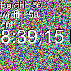

# noise-generator

Generates a random image with a specified `height` and `width` which includes the current time in the center.

## Query Parameters
| Param              | Accepted                   | Default    |
|--------------------|----------------------------|------------|
| height             | `Number(120...2048)`       | `120`      |
| width              | `Number(120...2048)`       | `120`      |
| cors               | `true` \| `false`          | `false`    |
| type               | `jpg` \| `mjpg` \| `.mjpg` | `jpg`      |
| mjpgInterval       | `Number(100...)`           | `100` (ms) |
| [mjpgMod]          | `offset` \| `padd`         |            |
| [mjpgHeaderMod]    | `noLength` \| `zeroLength` |            |
| [auth]             | `basic` \| `digest`        |            |
| [exposeAuthHeader] | `true` \| `false`          | `true`     |

### mjpgInterval
The interval in milliseconds in which the MJPEG stream sends a new frame

### mjpgMod - Optional
Different mods which can be applied to a MJPEG stream
- `offset`
  - One chunk will contain the lower half of the previous image frame and the upper half of the next image frame. This results in the client having to concat the received chunks excluding the contained payload header.
- `padd`
  - Adds a `512 Byte` padding to the end of a image frame

### mjpgHeaderMod - Optional
Mods which can be applied to the MJPEG payload header **NOT** the HTTP response header!
- `noLength`
  - Will not add a `Content-Length` header field
- `zeroLength`
  - Will add a `Content-Length` of `0` regardless of the actual length transmitted image

### auth - Optional
Will trigger the desired authentication method (`basic` or `digest`) will only expect the following credentials: `user:password`

### exposeAuthHeader - Optional
Sets the header `Access-Control-Expose-Headers: WWW-Authenticate`

## GCI
The `stream.cgi` endpoints simulates a mjpg stream being served from a cgi endpoint. All queries are supported except the type param, the stream type will always be `mjpg`?

## Docker
`docker pull ghcr.io/idoodler/noise-generator:latest`

